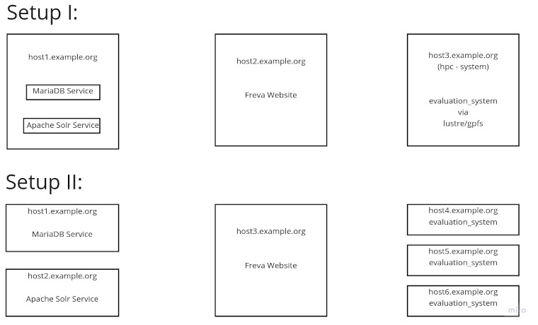

# Deployment of the Free Evaluation Framework Freva

The code in this repository is used to deploy freva in different computing environments. The general strategy is to split the deployment into 4 different steps, these are :
- Deploy MariaDB service via docker
- Deploy a Hashicorp Vault service for storing and retrieving passwords and other sensitive data via docker (this step get automatically activated once the MariaDB service is set)
- Deploy Apache Solr service via docker
- Deploy command line interface backend ([evaluation_system](https://gitlab.dkrz.de/freva/evaluation_system))
- Deploy web frontend ([freva_web](https://gitlab.dkrz.de/freva/freva_web))


> **_Note:_** A vault server is auto deployed once the mariadb server is deploed. The vault centrally stores all passwords and other sensitive data. During the deployment of the vault server a public key is generated which is used to open the vault. This public key will be saved in the `evaluation_system` backend root directory. Only if saved this key and the key in the vault match, secrets can be retrieved. Therefore it might be a good idea to deploy, the mariadb server (and with it the vault) and the `evaluation_system` backend togehter.

On *CentOS* python SELinux libraries need to be installed. If you choose to install ansible via the `install_ansible` you'll have to use `conda` to install libselinux for your CentOS version. For example : `conda install -c conda-forge  libselinux-cos7-x86_64`

# Pre-Requisites
The main work will be done by [ansible](https://docs.ansible.com/ansible/latest/index.html), hence the system which executes the deployment will need ansible.
Since we are using ansible we can use this deployment routine from any \*nix system (like a Mac-book). You do not need to run the depoyment on the machines where things get installed.
The only requirement is that you have to setup ansible and you can establish ssh connections to the servers.
## Install ansible on the (local) deployment machine:
To install ansible you have three different options:
### Option 1: Installing all required packages via the systems software repository (with admin rights)
The following software/packages need to be installed on your system:
- python3.6+
- ansible
- python3 yaml packages
- python3 pymysql packages
- sshpass
- libselinux-python3 (on CentOS systems only)

### Option 2: Installing ansible to an already existing anaconda environment:
If you are running an anaconda environment you can simply install ansible into an existing conda environment:

```bash
conda install -c conda-forge ansible
```

or create a new conda environment:

```bash
conda create -c conda-forge -n freva-deployment -c conda-forge pip conda ansible
```

### Option 3: Creating a local installation of ansible (without admin rights)
If ansible is not available on your system and/or you don't have sufficient rights to install it, you can install it 
you can still install it via the `install_ansible` command:

```bash
python install_ansible --help
usage: install_ansible [-h] [--shell SHELL]
                       [--arch {Linux-x86_64,MacOSX-x86_64,Linux-armv7l,Linux-ppc64le,Linux-s390x,Linux-x86,Linux-x86_64,MacOSX-arm64,MacOSX-x86Windows-x86,Windows-x86_64}]

This Programm installs ansible

optional arguments:
  -h, --help            show this help message and exit
  --shell SHELL         Shell type (default: bash)
  --arch {Linux-x86_64,MacOSX-x86_64,Linux-armv7l,Linux-ppc64le,Linux-s390x,Linux-x86,Linux-x86_64,MacOSX-arm64,MacOSX-x86Windows-x86,Windows-x86_64}
                        The architecture for the current system (default:
                        Linux-x86_64)

```
> **_Note:_**: If you're using Windows you will need to have a working anaconda version installed on your machine and need to use the anaconda command prompt to execute the deployment.
```bash
python install_ansible; source ./ansible/bin/activate
```
instead of sourcing the environment you can also use conda actvate: `conda actviate ./ansible`; if you have conda installed.

This command installs ansible and all required python packages.
> **_Note:_** On *CentOS* python SELinux libraries need to be installed. If you choose to install ansible via the `install_ansible` you'll have to use `conda` to install libselinux for your CentOS version. For example : `conda install -c conda-forge  libselinux-cos7-x86_64`

## Installing docker and sudo access to the service servers
Since the services of MariaDB and Apache Solr will be deployed on docker container images, docker needs to be available on the target servers. Usually installing and running docker requires *root* privileges.
Hence, on the servers that will be running docker you will need root access. There exist an option to install and run docker without root, information on a root-less docker option
can be found [on the docker docs](https://docs.docker.com/engine/security/rootless/)

# Configuring the deployment
Once everything is setup the deployment can be configured via the main config file.  A template of a typical deployment configuration can be found in `config/inventory.tmpl`. 
**Please copy this file first to** `config/inventory`. After the file has been copied you have to edit it. You will need to set at least one `hostname` in the following sections:

- solrservers (hostname of the apache solr server)
- dbservers (hostname of the MariaDB server)
- webservers (hostname that will host the web site)
- backendservers (hostname(s) where the command line interface will be installed)

Two typical server topography could look the following:
|  |
|:--:| 
| *Two different server structures*. In setup I the services are running on the same host that servers two docker containers. The website is deployed on a dedicated server while the backend is installed on a hpc login node with access to a gpfs/lustre file system. Setup II deploys the MariaDB and Solr services on dedicated servers. The command line interfaces are also deployed on independent servers.|
---

## Setting the python environment
Some systems do not have access to python3.6+ by default (/usr/bin/python3). In such cases you can overwrite the `ansible_python_interpreter` in the inventory settings of the server section to point ansible to a custom `python3` bindary. For example

```
ansible_python_interpreter=/sw/spack-rhel6/miniforge3-4.9.2-3-Linux-x86_64-pwdbqi/bin/python3
```

# Running the deployment
After successful configuration you can run the ansible deployment. This is done via the `deploy` script:

```bash
usage: deploy [-h] [--config CONFIG]
              [--steps {services,web,backend,db,solr,backup} [{services,web,backend,db,solr,backup} ...]]
              [--python PYTHON] [--cert CERT] [--wipe] [--ask-pass]
              project_name

Deploy freva.

positional arguments:
  project_name          Name of the project

optional arguments:
  -h, --help            show this help message and exit
  --config CONFIG, -c CONFIG
                        Path to ansible inventory file. (default:
                        /home/wilfred/workspace/deployment/config/inventory)
  --steps {services,web,backend,db,solr,backup} [{services,web,backend,db,solr,backup} ...]
                        The services/code stack to be deployed (default: ['services', 'web',
                        'backend'])
  --python PYTHON       Python version to be used (default: 3.9)
  --cert CERT, --cert_file CERT, --cert-file CERT
                        Path to public certificate file. If none is given, default, a file will be
                        created. (default: None)
  --wipe                This option will empty any pre-existing folders/docker volumes. (Useful for a
                        truely fresh start) (default: False)
  --ask-pass            Connect to server via ssh passwd instead of public key. (default: False)
```

You will need to give a project name, for example `xces-ces` or `regiklim-ces`.
The `--steps` flags can be used if not all services should be deployed.
> **_Note:_** The database name of the the MariaDB database will be set to the project name.

# Accessing the services after deployment:
If the target machine where the services (solr, mariadb, web) were deployed
is a Linux machine you will have a `systemd` unit service was created.
You can control the the service via systemd. The unit has the following
structure `project_name-service`. For example `freva_dev-solr`:

```bash
systemctl status freva_dev-solr
```
The same applies for mariadb and web service.

# Kown Issues:
Below are possible solutions to some known issues:

### SSH connection fails:

```python
fatal: [host.name]: FAILED! => {"msg": "Using a SSH password instead of a key is not possible because Host Key checking is enabled and sshpass does not support this.  Please add this host's fingerprint to your known_hosts file to manage this host."}
```
- This means that you've never logged on to the server. You can avaoid this error message by simply logging on to the server for the first time.

### Playbook coplains about refused connections for the solr or db playbook

```python
fatal: [localhost]: FAILED! => {"changed": true, "cmd": "docker run --name \"test_ces_db\" -e MYSQL_ROOT_PASSWORD=\"T3st\" -p \"3306\":3306 -d docker.io/library/mariadb", "delta": "0:00:00.229695", "end": "2021-05-27 16:10:58.553280", "msg": "non-zero return code", "rc": 125, "start": "2021-05-27 16:10:58.323585", "stderr": "docker: Error response from daemon: driver failed programming external connectivity on endpoint test_ces_db (d106bf1fe310a2ae0e012685df5a897874c61870c5241f7a2af2c4ce461794c2): Error starting userland proxy: listen tcp4 0.0.0.0:3306: bind: address already in use.", "stderr_lines": ["docker: Error response from daemon: driver failed programming external connectivity on endpoint test_ces_db (d106bf1fe310a2ae0e012685df5a897874c61870c5241f7a2af2c4ce461794c2): Error starting userland proxy: listen tcp4 0.0.0.0:3306: bind: address already in use."], "stdout": "895ba35cdf5dcf2d4ec86997aedf0637bf4020f2e9d3e5775221966dcfb820a5", "stdout_lines": ["895ba35cdf5dcf2d4ec86997aedf0637bf4020f2e9d3e5775221966dcfb820a5"]}
```
- This means that there is already a service running on this port - in this case a local mariadb service. To avoid this error chose a different port in your `config/inventory` file.

### Playbook cannot create database tables because connections fails

```python
fatal: [localhost]: FAILED! => {"changed": false, "msg": "ERROR 1698 (28000): Access denied for user 'root'@'localhost'\n"}
```
- This is a common problem if you've set the mariadb docker host to be localhost. You can avoid the problem by setting the `db_host` variable to a non localhost type IP like 172.17.0.1. If you're not sure what IP to use try the following command 
```
docker inspect -f '{{range .NetworkSettings.Networks}}{{.IPAddress}}{{end}}' db_docker_name
``` 
you can figure out the `db_docker_name` using the following command: 
```
docker container ls
```

### Git related unit tests in backend playbook fail
Git pull and push commands tend to fail if you haven't configured git. In this case change into the /tmp/evaluation_system directory of the host that runs the playbook
then manually trigger the unit tests by 

```
FREVA_ENV=/path/to/root_dir make tests
```
You can then check the stderr for messages for git related issues. Usually it helps to configure git before hand:

```bash
git config --global init.defaultBranch main
git config --global user.name your_user
git config --global user.email your@email.com
```


# Advanced: Adjusting the playbook
Playbook templates and be found the in the `playbooks` directory. You can also add new variables to the playbook if they are present in the `config/inventory` file.
