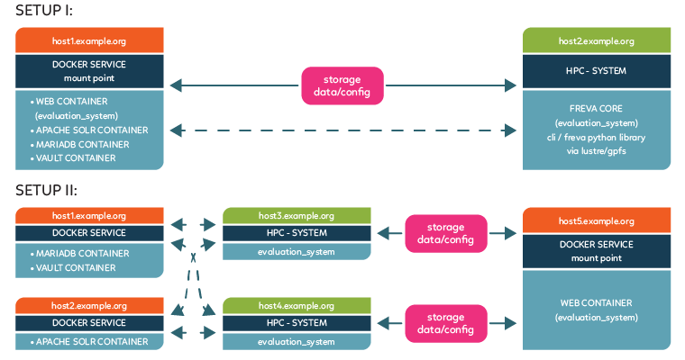

# Deployment of the Free Evaluation Framework Freva

[](https://freva-deployment.readthedocs.io/en/latest/?badge=latest)

The code in this repository is used to deploy freva in different computing
environments. The general strategy is to split the deployment into
4 different steps, these are :
- Deploy MariaDB service via docker
- Deploy a Hashicorp Vault service for storing and retrieving passwords
  and other sensitive data via docker
  (this step get automatically activated once the MariaDB service is set)
- Deploy Apache Solr service via docker
- Deploy command line interface backend ([evaluation_system](https://github.com/FREVA-CLINT/freva))
- Deploy web front end ([freva_web](https://gitlab.dkrz.de/freva/freva_web))


> **_Note:_** A vault server is auto deployed once the mariadb server is deployed.
The vault centrally stores all passwords and other sensitive data.
During the deployment of the vault server a public key is generated which is
used to open the vault. This public key will be saved in the `evaluation_system`
backend root directory. Only if saved this key and the key in the vault match,
secrets can be retrieved. Therefore it might be a good idea to deploy,
the mariadb server (and with it the vault) and the `evaluation_system`
backend togehter.

On *CentOS* python SELinux libraries need to be installed. If you choose to
install ansible via the `install_ansible` you'll have to use `conda` to
install libselinux for your CentOS version.
For example : `conda install -c conda-forge  libselinux-cos7-x86_64`

# Pre-Requisites
The main work will be done by
[ansible](https://docs.ansible.com/ansible/latest/index.html), hence some level
of familiarity with ansible is advantagous. Since we are using ansible we can
use this deployment routine from a workstation computer (like a Mac-book).
You do not need to run the depoyment on the machines where things get installed.
The only requirement is that you have to setup ansible and you can establish
ssh connections to the servers.
### Preparation on windows based system (without wsl).
Currently ansible is not natively available on windows based systems. You can use
the unix runtime environment [cygwin](https://www.cygwin.com) to download
and install the needed software. Just follow the steps listed on the web page
to setup cygwin on your windows system. In order to be able to install the
freva deployment programm you'll first need to install the following packages
via cygwin:

- python3
- python3-devel
- git
- make
- python3.X-paramiko
- libffi-devel
- ansible

We also recommend installing a command line based text editor like vim, nano, etc.

After installing the above listed packages via cygwin you can clone and
install the freva deployment:

```console
python3 -m pip install -U freva-deployment
```
Add the `--user` flag if you don't have sufficient rights.
## Installation on \*nix systems or wsl.
If you're using Linux, OsX or a Windows subsystem for Linux (WSL) it should
be sufficient to issues the following commands:

```console
python3 pip install -U freva-deployment
```

This command installs ansible and all required python packages.
> **_Note:_** On *CentOS* python SELinux libraries need to be installed.
> You will need to install libselinux for your CentOS version.

```console
python3 -m pip install libselinux-python3
```

## Commands after installation:
The `pip install` command will create *four* different commands:
- `deploy-freva-map`: To setup a service that keeps track of all deployed
   freva instances and their services.
- `deploy-freva`: Text user interface to configure and run the deployment.
- `deploy-freva-cmd`: Run already configured deployment.
- `freva-service`: Start|Stop|Restart|Check services of freva instances.
- `freva-migrate`: Command line interface to manage project migration from
   old freva systems to new ones.
If you can't find the commands mentioned above pip was probably installing
them in the user space. In that case you need to append your `PATH`
environment variable by `~/.local/bin`.If you use bash for example, add
the following command to your local `.bashrc`:

```console
export PATH=$PATH:$HOME/.local/bin
```


## Installing docker/podman and sudo access to the service servers
Since the services of MariaDB, Apache Solr and Apache web will be deployed on
docker container images, docker needs to be available on the target servers.
Usually installing and running docker requires *root* privileges.
Hence, on the servers that will be running docker you will need root access.
There exist an option to install and run docker without root,
information on a root-less docker option
can be found [on the docker docs](https://docs.docker.com/engine/security/rootless/)
> **_Note:_** Some systems use `podman` instead of `docker`. The deployment
routine is able to distinguish and use the right service.

## Setting up a service that maps the server structure (Optional)
Since the services might be scattered across different servers it might be hard
to keep track of the host names of the servers where all services are running.
We have created a service that keeps track of the locations of all services for
a certain freva instance. Although not strictly needed we recommend you to setup
this special server mapping service. To do so use the following command:

```console
deploy-freva-map --help
usage: deploy-freva-map [-h] [--port PORT] [--wipe] [--user USER] [--python-path PYTHON_PATH] [-v] [-V] servername

Create service that maps the freva server architecture.

positional arguments:
  servername            The server name where the infrastructure mapping service is deployed

options:
  -h, --help            show this help message and exit
  --port PORT           The port the service is listing to (default: 6111)
  --wipe                Delete any existing data. (default: False)
  --user USER           Username to log on to the target server. (default: None)
  --python-path PYTHON_PATH
                        Path to the default python3 interpreter on the target machine. (default: /usr/bin/python)
  -v, --verbose         Verbosity level (default: 0)
  -V, --version         show program's version number and exit
```
> **_Note_:** As the service keeps track of all freva instances within your
institution, this has to be deployed only *once*. Please make sure that other
admins who might need to install freva are aware of the host name
for this service. *This step is optional*

# Configuring the deployment
A complete freva instance will need the following services:

- solrservers (hostname of the apache solr server)
- dbservers (hostname of the MariaDB server)
- webservers (hostname that will host the web site)
- backendservers (hostname(s) where the command line interface will be installed)

Two typical server topography could look the following:
|  |
|:--:|
| *Two different server structures*. In setup I the services are running on the same host that serve 4 docker containers. The backend is installed on a hpc login node with access to a gpfs/lustre file system. Setup II deploys the MariaDB, Solr services and the website on dedicated servers. The command line interfaces are also deployed on independent servers.|
---

## Setting the python and git path
Some systems do not have access to python3.6+ (/usr/bin/python3) or git by default.
In such cases you can overwrite the `ansible_python_interpreter` in the inventory
settings of the server section to point ansible to a custom `python3` bindary.
For example

```
ansible_python_interpreter=/sw/spack-rhel6/miniforge3-4.9.2-3-Linux-x86_64-pwdbqi/bin/python3
```

The same applies to the path to the git binary:

```
git_path=/sw/spack-levante/git-2.31.1-25ve7r/bin/git
```

# Running the deployment
After successful configuration you can run the deployment.
The command `deploy-freva` opens a text user interface (tui) that will walk
you through the setup of the deployment.
The tui allows to edit, save, load and run a configuration file

> **_Note:_** Navigation is similar to the one of the *nano* text editor.
> The shortcuts start with a `^` which indicates `CTRL+`.
> * the pop up menus (e.g. `Exit`) must be navigated pressing `tab` to
> select the options and then `Enter`.
> * the configuration files must be saved as a `.toml` as the the tui
> only recognises this extension.
> * to paste with the mouse (\*nix style), double middle click.


## Unique identifiers via a domain flag
Different freva instances are installed across different institutions. Usually
the different freva instances running at an institution are distinguished by
a unique project name associated with each freva instance for example `xces`.
To make the project names unique across institutions (domains) a domain flag
should be set for the deployment. For example all freva instances running at
the German Climate Computing Centre will get the `dkrz` domain flag while freva
instances running at Free Uni Berlin get the `fub` domain flag. This allows for
easy identification of the right freva instance for remote servicing.
Please remember to set the correct domain flag for `deployment`, `servicing` and
`migration` of an old freva system.

## Deployment with existing configuration.
If you already have a configuration saved in a toml base inventory file you can
issue the `deploy-freva-cmd` command:

```bash
deploy-freva-cmd --help
usage: deploy-freva-cmd [-h] [--server-map SERVER_MAP] [--config CONFIG]
                        [--steps {services,web,core,db,solr,backup} [{services,web,core,db,solr,backup} ...]] [--ask-pass] [-v] [-V]

Deploy freva and its services on different machines.

options:
  -h, --help            show this help message and exit
  --server-map SERVER_MAP
                        Hostname of the service mapping the freva server archtiecture, Note: you can create a server map by running
                        the deploy-freva-map command (default: None)
  --config CONFIG, -c CONFIG
                        Path to ansible inventory file. (default: /home/wilfred/.config/freva/deployment/inventory.toml)
  --steps {services,web,core,db,solr,backup} [{services,web,core,db,solr,backup} ...]
                        The services/code stack to be deployed (default: ['services', 'web', 'core'])
  --ask-pass            Connect to server via ssh passwd instead of public key. (default: False)
  -v, --verbose         Verbosity level (default: 0)
  -V, --version         show program's version number and exit
```

The `--steps` flags can be used if not all services should be deployed.

# Accessing the services after deployment:
If the target machine where the services (solr, mariadb, web) were deployed
is a Linux machine you will have a `systemd` unit service was created.
You can control the service via the `freva-service` command:

```console
freva-service --help
usage: freva-service [-h] [--server-map SERVER_MAP] [--services {web,db,solr} [{web,db,solr} ...]] [--user USER] [-v] [-V]
                     {start,stop,restart,status} [project_name]

Interact with installed freva services.

positional arguments:
  {start,stop,restart,status}
                        The start|stop|restart|status command for the service
  project_name          Name of the project (default: all)

options:
  -h, --help            show this help message and exit
  --server-map SERVER_MAP
                        Hostname of the service mapping the freva server archtiecture, Note: you can create a server map by running
                        the deploy-freva-map command (default: None)
  --services {web,db,solr} [{web,db,solr} ...]
                        The services to be started|stopped|restarted|checked (default: ['solr', 'db', 'web'])
  --user USER, -u USER  connect as this user (default: None)
  -v, --verbose         Verbosity level (default: 0)
  -V, --version         show program's version number and exit
```
The following command restarts `web` server for the `xces`:
```console
freva-service restart xces --services web --user k12345
```
All services (`db`, `web` and `solr`) will be selected if the `--services` option
is omitted.

# Kown Issues:
Below are possible solutions to some known issues:

### SSH connection fails:

```python
fatal: [host.name]: FAILED! => {"msg": "Using a SSH password instead of a key is not possible because Host Key checking is enabled and sshpass does not support this.  Please add this host's fingerprint to your known_hosts file to manage this host."}
```
- This means that you've never logged on to the server. You can avoid this error message by simply logging on to the server for the first time.

### Playbook complains about refused connections for the solr or db playbook

```python
fatal: [localhost]: FAILED! => {"changed": true, "cmd": "docker run --name \"test_ces_db\" -e MYSQL_ROOT_PASSWORD=\"T3st\" -p \"3306\":3306 -d docker.io/library/mariadb", "delta": "0:00:00.229695", "end": "2021-05-27 16:10:58.553280", "msg": "non-zero return code", "rc": 125, "start": "2021-05-27 16:10:58.323585", "stderr": "docker: Error response from daemon: driver failed programming external connectivity on endpoint test_ces_db (d106bf1fe310a2ae0e012685df5a897874c61870c5241f7a2af2c4ce461794c2): Error starting userland proxy: listen tcp4 0.0.0.0:3306: bind: address already in use.", "stderr_lines": ["docker: Error response from daemon: driver failed programming external connectivity on endpoint test_ces_db (d106bf1fe310a2ae0e012685df5a897874c61870c5241f7a2af2c4ce461794c2): Error starting userland proxy: listen tcp4 0.0.0.0:3306: bind: address already in use."], "stdout": "895ba35cdf5dcf2d4ec86997aedf0637bf4020f2e9d3e5775221966dcfb820a5", "stdout_lines": ["895ba35cdf5dcf2d4ec86997aedf0637bf4020f2e9d3e5775221966dcfb820a5"]}
```
- This means that there is already a service running on this port - in this case a local mariadb service. To avoid this error chose a different port in your `config/inventory` file.

### Playbook cannot create database tables because connections fails

```python
fatal: [localhost]: FAILED! => {"changed": false, "msg": "ERROR 1698 (28000): Access denied for user 'root'@'localhost'\n"}
```
- This is a common problem if you've set the mariadb docker host to be localhost. You can avoid the problem by setting the `db_host` variable to a non localhost type IP like 172.17.0.1. If you're not sure what IP to use try the following command
```
docker inspect -f '{{range .NetworkSettings.Networks}}{{.IPAddress}}{{end}}' db_docker_name
```
you can figure out the `db_docker_name` using the following command:
```
docker container ls
```

### Git related unit tests in core playbook fail
Git pull and push commands tend to fail if you haven't configured git. In this case change into the /tmp/evaluation_system directory of the host that runs the playbook
then manually trigger the unit tests by

```
FREVA_ENV=/path/to/root_dir make tests
```
You can then check the stderr for messages for git related issues. Usually it helps to configure git before hand:

```bash
git config --global init.defaultBranch main
git config --global user.name your_user
git config --global user.email your@email.com
```


# Advanced: Adjusting the playbook
Playbook templates and be found the in the `playbooks` directory. You can also add new variables to the playbook if they are present in the `config/inventory` file.
