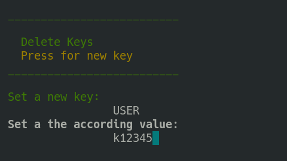

# Running and configuring the deployment
A complete Freva instance will need the following services:

- solr servers (hostname of the apache solr server)
- db servers (hostname of the MariaDB server)
- web servers (hostname that will serve web ui)
- core servers (hostname(s) where the command line interface will be installed)

## Setting the python and git path
Some systems do not have access to python3.4+ (/usr/bin/python3) or git by default.
In such cases you can overwrite the `ansible_python_interpreter` in the inventory
settings of the server section to point ansible to a custom `python3` bindary. For example

```
ansible_python_interpreter=/sw/spack-rhel6/miniforge3-4.9.2-3-Linux-x86_64-pwdbqi/bin/python3
```

The same applies to the path to the git binary:

```
git_path=/sw/spack-levante/git-2.31.1-25ve7r/bin/git
```
## A map of your server infrastructure (optional)
Different Freva instances are installed across different server hosts. Usually
the different Freva instances running at an institution are distinguished by
a unique project name for example `clex`.
To keep track of all server and services we have created a service that keeps
track of the locations of all services for certain Freva instances.
*Before* the first deployment we recommend to setup this server map by issuing
the `deploy-freva-map` command. Please also refer to the [installation section](Installation.html#setting-up-a-service-that-maps-the-server-structure)
for more details. This step is only necessary *once* per institution, please talk
to the admins of any other Freva instances at your institution if this service
has already been set up.


## Running the deployment
After successful configuration you can run the deployment.
The command `deploy-freva` opens a text user interface (tui) that will walk
you through the setup of the deployment.
> **_Note:_** Navigation is similar to the one of the *nano* text editor.
The shortcuts start with a `^` which indicates `CTRL+`.

Please refer to the [Appendix I](TuiHowto.html) on tui usage instructions.

### Deployment with existing configuration.
If you already have a configuration saved in a toml inventory file you can
issue the `deploy-freva-cmd` command:

```console
deploy-freva-cmd --help
usage: deploy-freva-cmd [-h] [--server-map SERVER_MAP] [--config CONFIG] [--steps {web,core,db,solr} [{web,core,db,solr} ...]]
                        [--ask-pass] [-v] [-V]

Deploy Freva and its services on different machines.

optional arguments:
  -h, --help            show this help message and exit
  --server-map SERVER_MAP
                        Hostname of the service mapping the Freva server architecture, Note: you can create a server map by running
                        the deploy-freva-map command (default: None)
  --config CONFIG, -c CONFIG
                        Path to ansible inventory file. (default: /home/wilfred/.config/freva/deployment/inventory.toml)
  --steps {web,core,db,solr} [{web,core,db,solr} ...]
                        The services/code stack to be deployed (default: ['db', 'solr', 'web', 'core'])
  --ask-pass            Connect to server via ssh passwd instead of public key. (default: False)
  -v, --verbose         Verbosity level (default: 0)
  -V, --version         show program's version number and exit
```

The `--steps` flags can be used if not all services should be deployed.

## Using environment variables
Once the deployment configuration is set up it might be useful to store the
config and all the files that are needed to run the deployment at a central,
yet *secure* location. This can be useful if multiple admins will have to take
turns in (re)-deploying the system and thus the configuration has to be up to
date for those admins. The problem that arises is that the setup might differ
slightly for each person and computer running the deployment. For instance the
`ansible_user` key might differ. For this purpose the deployment supports setting
environment variables. Those environment variables can be used in the configuration
file. Like `ansible_user = $USER`. You can then set up the `USER` variable with
help of the deployment tui. To do so open the main menu (`CTRL+x`) and then
choose the add set variables options (`CTRL+v`). You can then add or edit
variables. In the figure below the `USER` variable is set to a specific user
name. If the deployment encounters an entry using `$USER` variable it will be
replaced by the according value that points to the `$USER` variable.




## Advanced: Adjusting the playbook
Playbook templates and be found the in the `~/.config/freva/deployment/playbooks` directory.
You can customise those playbooks if the standard installation procedure is
not well suited. Each deployment section offers the option to set paths
to custom playbook files instead of the standard playbook files. To change
the behaviour of the installation for a certain freva instance, simply adjust
the path to the playbook for that step in the inventory file or tui. For example:

- `web_playbook = '/home/myuser/playbooks/my-web.yml'`


## Known Issues:
Below are possible solutions to some known issues:

#### SSH connection fails:

```python
fatal: [host.name]: FAILED! => {"msg": "Using a SSH password instead of a key is not possible because Host Key checking is enabled and sshpass does not support this.  Please add this host's fingerprint to your known_hosts file to manage this host."}
```
- This means that you've never logged on to the server. You can avoid this error message by simply logging on to the server for the first time.

#### Playbook complains about refused connections for the solr or db playbook

```python
fatal: [localhost]: FAILED! => {"changed": true, "cmd": "docker run --name \"test_ces_db\" -e MYSQL_ROOT_PASSWORD=\"T3st\" -p \"3306\":3306 -d docker.io/library/mariadb", "delta": "0:00:00.229695", "end": "2021-05-27 16:10:58.553280", "msg": "non-zero return code", "rc": 125, "start": "2021-05-27 16:10:58.323585", "stderr": "docker: Error response from daemon: driver failed programming external connectivity on endpoint test_ces_db (d106bf1fe310a2ae0e012685df5a897874c61870c5241f7a2af2c4ce461794c2): Error starting userland proxy: listen tcp4 0.0.0.0:3306: bind: address already in use.", "stderr_lines": ["docker: Error response from daemon: driver failed programming external connectivity on endpoint test_ces_db (d106bf1fe310a2ae0e012685df5a897874c61870c5241f7a2af2c4ce461794c2): Error starting userland proxy: listen tcp4 0.0.0.0:3306: bind: address already in use."], "stdout": "895ba35cdf5dcf2d4ec86997aedf0637bf4020f2e9d3e5775221966dcfb820a5", "stdout_lines": ["895ba35cdf5dcf2d4ec86997aedf0637bf4020f2e9d3e5775221966dcfb820a5"]}
```
- This means that there is already a service running on this port - in this case a local mariadb service. To avoid this error chose a different port in your `config/inventory` file.

#### Playbook cannot create database tables because connections fails

```python
fatal: [localhost]: FAILED! => {"changed": false, "msg": "ERROR 1698 (28000): Access denied for user 'root'@'localhost'\n"}
```
- This is a common problem if you've set the mariadb docker host to be localhost. You can avoid the problem by setting the `db_host` variable to a non localhost type IP like 172.17.0.1. If you're not sure what IP to use try the following command
```
docker inspect -f '{{range .NetworkSettings.Networks}}{{.IPAddress}}{{end}}' db_docker_name
```
you can figure out the `db_docker_name` using the following command:
```
docker container ls
```

### Stuck in load/save dialogue in the tui
The load/save forms can be exited by pressing the `<TAB>` key
which will get you to input field at the bottom of the screen. If the input
field has text delete it an press the `<ESC>` key, this will bring you get to
the screen where you started.
