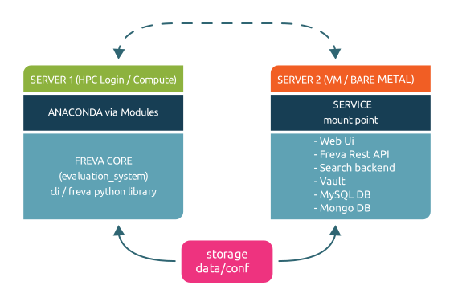
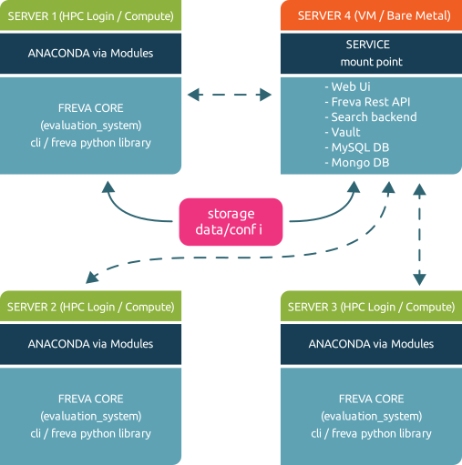

# Freva Architecture

The Free evaluation system framework (Freva) consists of three basic parts:

- core library (`evaluation_system`) that handles request to the data search engine and database as well as configuring and submitting data analysis plugins
- command line interface and a python client as user interface to the core library.
- services, such as a apache solr data search service, mariadb database and web service providing a web-based user interface (web ui) to the core library

Command line interface, python client and web ui make use of the core library, the core library on the other hand makes use of the apache solr and mariadb services. This hierachy is outlined in the figure below:

### Core library and command line interface:

The core library (`evaluation_system`) and the command line interface (cli) are
installed within the anaconda environments. Anaconda has the advantage
that it comes with its own python distribution and hence any python instance
can be made independent of the host system. The disadvantage is that it
occupies a relatively large amount space in small files.
The latter fact is can be disadvantageous for distributed file systems.

### Services:

As already mentioned the evaluation system framework needs two principle services to function:

- apache solr for search and indexing data
- mariadb for creating plugin history entries

On top of that a vault service that stores database login credentials is setup to enhance security.
The above mentioned services are running on docker/podman containers. Docker/podman was chosen over the
direct installation on  the host system, such as a Virtual Machine (VM) or a bare machine
because OS specifications that are determined by the container setup make a
configuration of the service system agnostic - e.i. no specifications of the
host OS - such as SELinux - has to be taken into account.
The drawback of this approach is that docker/podman has to be present on the
host system. Yet, compared to the advantages of this approach this is a
minor setback.

### Web based user interface:

Like the services the web ui is also deployed in a docker container.
Again we've chosen this approach for host OS independent configuration reasons.
Because the each scientific project that deploys its own instance of the
evaluation system framework comes with a unique stack of data and data
analysis plugins the web ui must reflect this project specific configuration.
For this reason it is essential that the command line interface - typically
installed on a HPC login node - and the web ui share a common
central configuration file. A setup that uses two independent instances of a
configuration - one for the cli and one for the web ui - is not favourable as
configuration setups might diverge over time. Therefore we decided the cli
configuration on a HPC login node to be the master configuration. Which means
that the web ui will also has to have access to this configuration files. If
the web ui service is not running on the same machine the cli instance is
running on - which should be usually the case - the location of the configuration
has to be made available via a *mount* to the machine where this web
ui container is running on. This can usually be achieved by mounting the
content via a network based file system, such as nfs, or a cluster file
system such as gpfs to the web ui machine.

> ``📝`` The web ui contains of three different parts: a django web
application container that runs the web sites code, a redis container acting
as database cache and a apache httpd container as a reverse proxy forwarding
client requests to the django web application.

## Setups
The next sections propose various deployment strategies for the framework:

### One service one machine set up:

*One service one machine*: Every service is installed on a dedicated machine

This setup deploys the cli on a central instance and the services on dedicated machines (VM or bare metal).
We recommend this setup since it minimises the load on each host machine and minimises failure due to load issues.
In a typical scenario the core configuration stored in a central location is made accessible to the machine hosting the web ui container.
The cli also connects and communicates to machines hosting the apache solr and mariadb containers.
The vault server will always be running on the same machine that hosts the mariadb service.

### All services on one machine set up:

*All services on one machine*: All services are installed on the same machine

This setup deploys the cli on a central instance and all services on one single machine
(VM or bare metal). While this set up might be prone to load failure unless
enough resources a allocated to the machine, it is probably most simple
to administer since all services are running on one entry point.

### Multi-cli setup:

*Multi-cli*: The command line interface and core library are installed on many compute nodes

Distributed file systems, such as gpfs or lustre, can be slow - therefore
it is recommend to NOT deploy the anaconda environments for cli and core library on such file systems.
The above above mentioned anaconda setup creates a considerable amount of small
files, which has performance penalties on distributed file systems.
Therefore it is recommended to deploy the core library and the cli via a cluster of machines.
