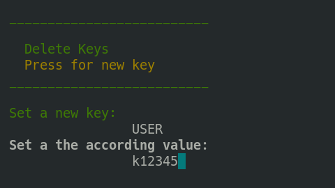

# Configuring and running the deployment
A complete Freva instance will need the following services:

- databrowser servers (host name of the databrowser server)
- db servers (host name of the MariaDB server)
- web servers (host name that will serve web ui)
- core servers (host name(s) where the command line interface will be installed)

## Running the deployment
The command `deploy-freva` opens a text user interface (tui) that will walk
you through the setup of the deployment.
> **_Note:_** Navigation is similar to the one of the *nano* text editor.
The shortcuts start with a `^` which indicates `CTRL+`.

Please refer to the [usage of the text user interface section](TuiHowto)
on tui usage instructions.

### Deployment with existing configuration.
Although we recommend you to follow the [deployment tui](TuiHowto) you can also
directly use [toml](http://toml.io) configuration files for setting up the
deployment. Two examples of such deployment configurations can be found
in the [example deployment configuration](Config) section.

If you already have a configuration saved in a toml configuration file you can
issue the `deploy-freva-cmd` command:

```bash
deploy-freva-cmd --help
Usage: deploy-freva-cmd [-h] [--config CONFIG] [--steps {web,core,db,databrowser,auto} [{web,core,db,databrowser,auto} ...]] [--ask-pass] [--ssh-port SSH_PORT] [-v] [-l]
                        [-g] [-V]

Deploy freva and its services on different machines.

Options:
  -h, --help            show this help message and exit
  --config, -c CONFIG   Path to ansible inventory file. (default: /home/wilfred/.anaconda3/envs/python3_12/share/freva/deployment/inventory.toml)
  --steps, -s {web,core,db,databrowser,auto} [{web,core,db,databrowser,auto} ...]
                        The services/code stack to be deployed. Use auto to only deploy outdated services (default: ['db', 'databrowser', 'web', 'core'])
  --ask-pass            Connect to server via ssh passwd instead of public key. (default: False)
  --ssh-port SSH_PORT   Set the ssh port, in 99.9% of the cases this should be 22 (default: 22)
  -v, --verbose         Verbosity level (default: 0)
  -l, --local           Deploy services on the local machine, debug purpose. (default: False)
  -g, --gen-keys        Generate public and private web certs, use with caution. (default: False)
   --skip-version-check  Skip the version check. Use with caution. (default: False)
  -V, --version         show program's version number and exit

```
The `--steps` flags can be used if not all services should be deployed.

## Setting the python and git path
Some systems do not have access to python3.4+ (/usr/bin/python3) or git by default.
In such cases you can overwrite the `ansible_python_interpreter` in the inventory
settings of the server section to point ansible to a custom `python3` binary. For example

```
ansible_python_interpreter=/sw/spack-rhel6/miniforge3-4.9.2-3-Linux-x86_64-pwdbqi/bin/python3
```

The same applies to the path to the git binary:

```
git_path=/sw/spack-levante/git-2.31.1-25ve7r/bin/git
```

## Setting up the deployment without root-privileges
Sometimes it can be necessary, either due to security concerns or user rights
restrictions, to set up all services as a un-privileged user. Since version
`v2402.0.0` the deployment routine supports such setup scenarios.

Especially when security is a concern we recommend you to use `podman` instead
of `docker` for setting up the freva infrastructure. This can be done by simply
[installing `podman`](https://podman.io/docs/installation) on the machines where any of the above mentioned services are
deployed. There is also an [conda-forge packages](https://anaconda.org/conda-forge/podman)
available for installation.

Root less installation works essentially just like root based installation. You
only have to either set the `become_user` configuration to a user name that is
different from `root` or leave it blank. In case you leave it blank the login
user will deploy the services. You can find a working minimal example in the
[deployment configuration example section](Config.html#deployment-with-non-root-privilege)

Although root-less installation is straight forward it comes with two caveats
that should be kept in mind:

*User based systemd services*: The [systemd](https://systemd.io/) units are not installed system wide but
on user basis, which means that you can access the service using the `--user`
flag: for example:

```console
systemctl status --user freva-web
```

instead of

```console
systemctl status freva-web
```

This also means that in its default configuration systemd will terminate all
running user services as soon as the user terminates a login session.
To avoid this you have to enable 'lingering' states of services for that user:

```console
loginctl enable-linger [USER]
```

This command can only by applied by the root user. Backups are also done as
user instead of system wide basis, you can check the backups after deployment using
the `crontab -l` command.

*No direct access to ports 80 and 443*: The freva web user interface cannot directly be accessed by a web server
listing on port 80 and 443 as those ports are off limits for normal users. If
you choose to deploy the web app as an unprivileged user the apache httpd web
server serving the web app will be running on port 9080 instead of 80 and port
9443 instead of 443. You can either communicate the usage of those  ports to
the users of the system, or **recommended**, set up a simple redirect on
another httpd server that is running on the server where the web app is
deployed. Although this httpd server needs a privileged user it only has to
be configured once. A simple configuration for *apache* httpd looks the following:

```apache
<VirtualHost *:80>
    ServerName my-host
     Redirect permanent / https://www.my-host.org.au:9443
</VirtualHost>

<VirtualHost *:443>
    ServerName my-host
     Redirect permanent / https://www.my-host.org.au:9443
</VirtualHost>
```

This would redirect all traffic from http(s)://www.my-host.org to the
apache httpd container that serves the web app without having the users to
remember the specific ports. Similar configurations are available to other
web server software.


## Version checking
Because the system consists of multiple micro services the software will
perform a version check *before* the deployment to ensure that all versions
fit together. If you for example want to deploy the rest api the system will
also check an update of the freva cli if it finds that the cli library doesn't
fit with the latest version of the rest api. This ensures that all parts of the
system will work together.
> **_Note:_** You can disable this version checking by using the
  `--skip-version-check` flag. Use this flag with caution.


## Using environment variables
Once the deployment configuration is set up it might be useful to store the
config and all the files that are needed to run the deployment at a central,
yet *secure* location. This can be useful if multiple admins will have to take
turns in (re)-deploying the system and thus the configuration has to be up to
date for those admins. The problem that arises is that the setup might differ
slightly for each person and computer running the deployment. For instance the
`ansible_user` key might differ. For this purpose the deployment supports setting
environment variables. Those environment variables can be used in the configuration
file. Like `ansible_user = $USER`. You can then set up the `USER` variable with
help of the deployment tui. To do so open the main menu (`CTRL+x`) and then
choose the add set variables options (`CTRL+v`). You can then add or edit
variables. In the figure below the `USER` variable is set to a specific user
name. If the deployment encounters an entry using `$USER` variable it will be
replaced by the according value that points to the `$USER` variable.



### Relative paths using the $CFD variable
Instead of setting the absolute paths in the configuration files
for example the path to the public certificate files, you should give the
paths *relative* to the configuration file. To indicate that the
freva-deployment machinery should create paths relative to the configuration
you should set all paths starting with the `$CFD` (current file directory)
variable. For example if the configuration file is located in
`/home/user/config/foo/foo.toml` and the public cert file is located in the
same directory as the configuration file then you can set the path to the cert
file in the configuration files via `$CFD/foo.crt`.

This will assure that paths will work from any other machine.

## Advanced: Adjusting the playbook
Playbook templates and be found the in the `~/.config/freva/deployment/playbooks` directory.
You can customise those playbooks if the standard installation procedure is
not well suited. Each deployment section offers the option to set paths
to custom playbook files instead of the standard playbook files. To change
the behaviour of the installation for a certain freva instance, simply adjust
the path to the playbook for that step in the inventory file or tui. For example:

- `web_playbook = '/home/myuser/playbooks/my-web.yml'`


## Known Issues:
Below are possible solutions to some known issues:

### SSH connection fails:

```console
fatal: [host.name]: FAILED! => {"msg": "Using a SSH password instead of a key is not possible because Host Key checking is enabled and sshpass does not support this.  Please add this host's fingerprint to your known_hosts file to manage this host."}
```
- This means that you've never logged on to the server. You can avoid this error message by simply logging on to the server for the first time.

### Playbook complains about refused connections for the solr or db playbook

```console
fatal: [localhost]: FAILED! => {"changed": true, "cmd": "docker run --name \"test_ces_db\" -e MYSQL_ROOT_PASSWORD=\"T3st\" -p \"3306\":3306 -d docker.io/library/mariadb", "delta": "0:00:00.229695", "end": "2021-05-27 16:10:58.553280", "msg": "non-zero return code", "rc": 125, "start": "2021-05-27 16:10:58.323585", "stderr": "docker: Error response from daemon: driver failed programming external connectivity on endpoint test_ces_db (d106bf1fe310a2ae0e012685df5a897874c61870c5241f7a2af2c4ce461794c2): Error starting userland proxy: listen tcp4 0.0.0.0:3306: bind: address already in use.", "stderr_lines": ["docker: Error response from daemon: driver failed programming external connectivity on endpoint test_ces_db (d106bf1fe310a2ae0e012685df5a897874c61870c5241f7a2af2c4ce461794c2): Error starting userland proxy: listen tcp4 0.0.0.0:3306: bind: address already in use."], "stdout": "895ba35cdf5dcf2d4ec86997aedf0637bf4020f2e9d3e5775221966dcfb820a5", "stdout_lines": ["895ba35cdf5dcf2d4ec86997aedf0637bf4020f2e9d3e5775221966dcfb820a5"]}
```
- This means that there is already a service running on this port - in this case a local mariadb service. To avoid this error chose a different port in your `config/inventory` file.

### Playbook cannot create database tables because connections fails

```console
fatal: [localhost]: FAILED! => {"changed": false, "msg": "ERROR 1698 (28000): Access denied for user 'root'@'localhost'\n"}
```
- This is a common problem if you've set the mariadb docker host to be localhost. You can avoid the problem by setting the `db_host` variable to a non localhost type IP like 172.17.0.1. If you're not sure what IP to use try the following command

```console
docker inspect -f '{{range .NetworkSettings.Networks}}{{.IPAddress}}{{end}}' db_docker_name
```
you can figure out the `db_docker_name` using the following command:

```console
docker container ls
```

### Cannot pull/run container due to insufficient system UIDs.
When you run the services in rootless mode you might see this error message
when trying to pull/run container images:

```console
ERRO[0000] cannot find UID/GID for user foo: no subuid ranges found for user "foo" in /etc/subuid - check rootless mode in man pages.
```

To fix this issue you should set the `ignore_chown_errors` to `"true"`:

```console
grep ignore_chown_err /etc/containers/storage.conf
# ignore_chown_errors can be set to allow a non privileged user running with
ignore_chown_errors = "true"
```

```console
man storage.conf
…
       ignore_chown_errors = "false"
         ignore_chown_errors can be set to allow a non privileged user
         running with a  single UID within a user namespace to run containers.
         The user can pull and use any image, even those with multiple uids.
         Note multiple UIDs will be squashed down to the default uid in the
         container.  These images will have no separation between the users
         in the container. (default: false)
```

You might want to read [this article](https://www.redhat.com/sysadmin/controlling-access-rootless-podman-users)
for more information.

### Insufficient permissions when running in rootless mode (SELinux)
When running containers in rootless mode you might see errors like this:

```console
podman run --userns=keep-id
/bin/bash: error while loading shared libraries: libc.so.6: cannot change memory protections
```

This issues arises when the SELinux container context is not set for the local
user container storage location. You can set the context via:


```console
sudo semanage fcontext -a -t container_var_lib_t '/home/myuser/.local/share/containers/storage(/.*)?'
sudo restorecon -Rv /home/myuser/.local/share/containers/storage
```

### Stuck in load/save dialogue in the tui
The load/save forms can be exited by pressing the `<TAB>` key
which will get you to input field at the bottom of the screen. If the input
field has text delete it an press the `<ESC>` key, this will bring you get to
the screen where you started.
