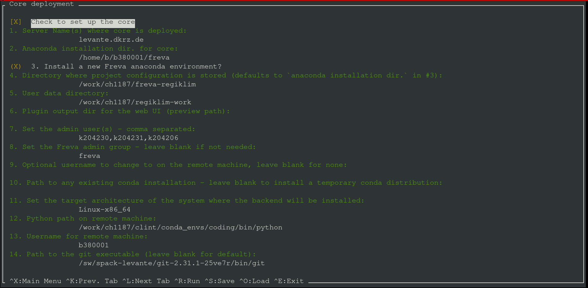
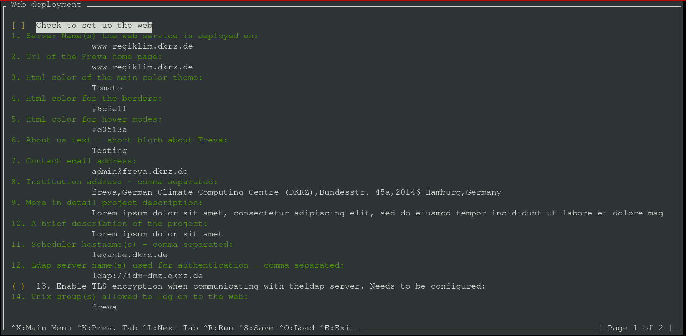
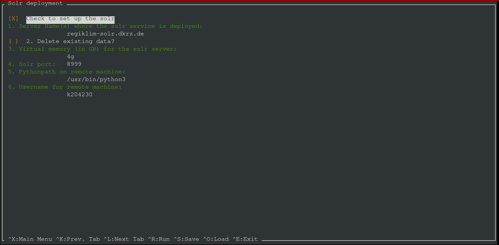
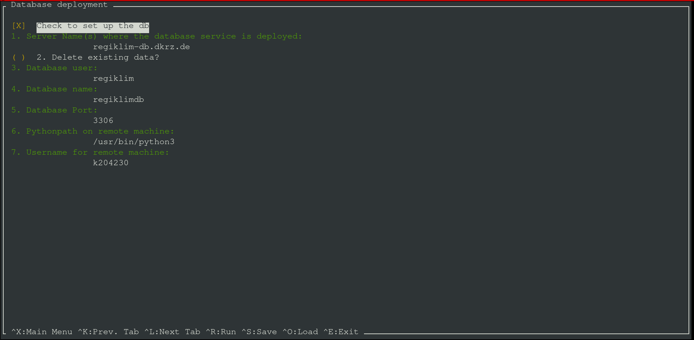

# Usage of the text user interface
We have create a simple text user interface (tui) that helps you setting up a
Freva instance at your institution. At this stage the documentation assumes that
you have installed the necessary server infrastructure and pre-requisites.
Please refer to the [installation](Installation) and [configuration section](Configure)
for more details.

After [Installation](Installation) the command `deploy-freva` will open
the tui. The tui is organized in five different screens. The first four screens
are used to configure the services (core, solr, database, web) the last screen
(run screen) configures variables that are common amongst all services.
The code of the tui is written using the [npyscreen](https://npyscreen.readthedocs.io/index.html)
library.

## General usage

After opening the tui with the `deploy-freva` command you'll see a small
navigation panel on the bottom. Navigation is done by shortcuts and similar
to those used in the *nano* text editor. All shortcuts start with
a `^` which indicates `CTRL+`, main shortcuts are:
> `CTRL+f`: Further information on each configuration item.
- `CTRL+x`: Enter main menu.
- `CRTL+v`: Edit/Add environment variables.
- `CTRL+o`: Load a saved configuration.
- `CTRL+s`: Save a configuration to a [`.toml`](https://toml.io/en/).
- `CTRL+k`: Go to previous *setup* screen.
- `CTRL+l`: Go to next *setup* screen.
- `CTRL+r`: Got to the *run* screen.
- `CTRL+d`: Clear the application cache.
- `CTRL+e`: Exit application.
> **_Note:_** The load/save forms can be exited by pressing the `<TAB>` key
which will get you to input field at the bottom of the screen. If the input
field has text delete it an press the `<ESC>` key, this will bring you get to
the screen where you started.

Some variables need to be set for the deployment setup while others don't and
can be configured later.

## Core setup
The first screen configures the setup of Freva at the HPC system. We refer to
this step as the *core* deployment. At the top of the screen you'll see a tick
box, which indicates whether or not this step is used for deployment. If this
box is *un*ticked - tick/untick using the `<SPACE>` key - the deployment will
skip the core installation on the HPC system. The following explains the
essential setup steps:

1. The host name(s) where the core installation is executed. You can use all
   [multi host patterns](https://docs.ansible.com/ansible/latest/user_guide/intro_patterns.html#common-patterns)
   that ansible supports.
1. The installation directory of the anaconda environment where the
   `freva` python library shall be installed installed.
1. Set the directory where project specific configuration is stored. See also
   the `root_dir` description in the
   [basic configuration section](Folders.html#configuring-the-evaluation-system-section).
1. Set the user plugin output directory. If you want to use a *local* output
   directory structure you can leave this variable blank. See also the
   [basic configuration section](Folders.html#configuring-the-evaluation-system-section).
1. Set the preview path mentioned in the
   [basic configuration section](Folders.html#configuring-the-evaluation-system-section).
1. Set the workload manager system from the dropdown menu.
1. Set the output directory of the `stdout`/`stderr` of the workload manger.
   __Note__: the workload manager type, like pbs, will be automatically
   appended to this directory.
1. Set the user names (comma separated) of the Freva admins of this project.
1. If you have a special user group for Freva admins you can set this this key
   here. This will cause the creation of folders with permissions suitable
   for multi-user write access (2775) on the target machine. This assures that
   multiple admins can adjust the Freva configuration. You can leave this
   variable blank.
1. If you need to change to a common user (for example via `sudo -i`) that is
   able to install Freva on the HPC system you can set this common user name
   here. Note that this method should only be used if freva needs to be set up
   with a shared user account *and* you cannot log on to the HPC system with
   this shared user name. Most of the time it should not be necessary to use
   this option, either because you don't need a shared user account, or you
   can instruct ansible to directly log on as the shared user.
1. If you have an anaconda binary already installed on the target system you
   can set the path to the `conda` or `mamba` executable here. Leaving this variable
   blank (default) will cause the deployment to temporary download and create
   an anaconda install script - which will get deleted afterwards.
1. Select a pre-defined target architecture for the anaconda environment.\
   _Note_: The Freva installation has only been tested for MacOSX-x86_64,
   Linux-x86_64 (including Windows wsl2) and Linux-aarch64 (arm).
1. If you want to customise the installation process you can set the path
    to a custom ansible playbook here. If this is set then the deployment
    will use this playbook instead of the default playbook that ships with
    the system. Leave blank for default behaviour.
1. Ansible needs python to be present on the remote machine, if not present
   in the default path (such as `/usr/bin/python3`) set the path to the `python3.4+`
   binary.
1. Set the login user name for the remote machine.
1. Set the path to the `git` executable if not in default path
   such as `/usr/bin/git`.

> ``📝`` Press CTRL+f for *f*urther information on each configuration item.

### Notes on the core setup
It is good practice to use only one anaconda environment for multiple Freva
instances. Each Freva instance only differs in its configuration
(`evaluation_system.conf`)

## Web ui setup
The second screen configures the setup web ui. At the top of the screen
you'll see a tick box, which indicates whether or not this step is used for
deployment. If this box is *un*ticked - tick/untick using the `<SPACE>` key -
the deployment will skip the web ui setup entirely. The following explains the
essential setup steps:

1. The host name where the web ui should be installed. This should be a single
   host name.
1. Set the path where the permanent database data should be stored.
   By default, this is set to `/opt/freva/<project_name>/web_service`.
1. The url the web ui can be accessed. Users will use this url to get access
   to the url.
1. Main html color scheme.
1. Html color for borders.
1. Html color for hover mode boxes.
1. Set the path to the institution logo. This should be the path to the logo
   on the machine that runs the web.
1. A short text about the Freva admin team/group. This text will go to the
   header of the web page.
1. Contact email address of the admin(s).
1. Smtp mail server host name. This mail server will be used to send emails
   from the web ui.
1. Address of the institute, will be appearing in the footer of the website.
1. Detailed overview over the project, this text will go into the left central
   box in the Freva main page. It should describe the purpose of this project
1. The header for the detailed overview mentioned in 9.
1. Host name(s) - usually HPC login node(s) - the web backend code submits
   plugin jobs from. The backend will logon to this host name and submit a
   plugin job.
1. String of ldap server uri(s) (comma separated). The ldap server uris are
   used to make authentication requests via the web side.
1. Tick this box (`<SPACE>`) to enable TLS encrypted connection from the django
   web application to the ldap server.
   [See also django ldap tls config](https://django-auth-ldap.readthedocs.io/en/latest/authentication.html#notes)
1. Set the user group name that is allowed to logon to the web ui.
1. Set the ldap user base filters. See also the
   [django ldap authentication for user](https://django-auth-ldap.readthedocs.io/en/latest/users.html)
1. Set the ldap group base filters. See also the
   [django ldap authentication for groups](https://django-auth-ldap.readthedocs.io/en/latest/groups.html#finding-groups)
1. Set the distinguished name of the ldap user. This setting is used to make
   queries to the ldap server. TODO: [this might not be necessary](https://django-auth-ldap.readthedocs.io/en/latest/authentication.html#search-bind)
1. Set the password for the ldap user.
1. Set the ldap search key for finding the first name entries
1. Set the ldap search key for finding the last name entries
1. Set the ldap search key for finding email addresses
1. Set the type of ldap object class name
1. Set the type of ldap group type (nested or posix). Note: This is a
    dropdown menu, hit enter to select the options.
1. Set the evaluation_system ldap class that handles the ldap connections
1. If you want to customise the installation process you can set the path
   to a custom ansible playbook here. If this is set then the deployment
   will use this playbook instead of the default playbook that ships with
   the system. Leave blank for default behaviour.
1. Set the path to the `python3.4+` binary, this should be set if the python
   binary is not part of the `$PATH` variable.
1. Set the user name that should execute the container commands, defaults
   to root. Leave blank if no special user is needed.
1. Set the login user name for the remote machine.

> ``📝`` Press CTRL+f for *f*urther information on each configuration item.

### Notes on the web ui setup
Currently there are ties between the core running on the HPC machine and
the web ui. These are:

- a common configuration `evaluation_system.conf` and
- a common preview folder. Plugins running on the HPC will store visual content
like plots into the plugin folder, which can be displayed by the web ui.

This interconnection is usually fulfilled creating a network mount from the
HPC system to the machine running the web ui. The deployment routine expects
the *preview* folder (the directory containing plots to be displayed on the web)
and `evaluation_system.conf` to be present (mounted)
on the host machine during deployment time. The docker container expects the
mounts to be in the same path as on the HPC system. For example, if
an instance of Freva has been deployed on `/work/clex/freva-clex` then
this directory should be available via the same path on the machine running
the web ui application. The same applies to all paths defined in the
plugin section in the `evaluation_system.conf`. Please also refer to the
[Architecture section](Architecture.html#web-based-user-interface) for more
information.

The web ui application service needs two more services, that are
automatically set up. Those are a redis service, which is used as a database
query cache and an apache httpd service that is used as reverse proxy.
The httpd configuration for the reverse proxy will be saved
`<datat_dir>/<project_name>/web_service/`.

During the deployment process of the web ui you will be ask your login
credentials for the smtp email server. An email server is necessary because
the web backend has a email sending functionality. This functionality makes
it easy for users to communicate and share results with other users.
Login credentials are needed to connect to the email server and send emails.
Your credentials won't be saved anywhere on disk but securely stored in the
vault service that gets deployed when setting up the database.

## Freva rest setup
The third screen configures the setup databrowser server. At the top of
the screen you'll see a tick box, which indicates whether or not this step is
used for deployment. If this box is *un*ticked - tick/untick using the
`<SPACE>` key - the deployment will skip the setup of databrowser entirely. The
following explains the essential setup steps:

1. The host name where the solr server should be installed. This should be a single
   host name.
1. Tick this box (`<SPACE>`) if you want to delete any pre existing databrowser data.
1. Select how much memory you want to allocate for the databrowser server process.
1. Select the port the databrowser server is running on.
1. Set the path where the permanent database data should be stored.
   By default, this is set to `/opt/freva/<project_name>/freva_rest_service`.
1. If you want to customise the installation process you can set the path
   to a custom ansible playbook here. If this is set then the deployment
   will use this playbook instead of the default playbook that ships with
   the system. Leave blank for default behaviour.
1. Set the user name that should execute the container commands, defaults
   to root. Leave blank if no special user is needed.
1. Set the path to the `python3.4+` binary, this should be set if the python
   binary is not part of the `$PATH` variable.
1. Set the login user name for the remote machine.

> ``📝`` Press CTRL+f for *f*urther information on each configuration item.

### Notes on the freva-rest setup
Any existing data is *not* overridden if you deploy
a new server and do not chose to delete any pre existing data. The
data will be saved to `<data_path>/<project_name>/databrowser_service/`
on the host name the databrowser server is running on.

## Database server setup
The fourth screen configures the setup database server. At the top of
the screen you'll see a tick box, which indicates whether or not this step is
used for deployment. If this box is *un*ticked - tick/untick using the
`<SPACE>` key - the deployment will skip the setup of the database entirely. The
following explains the essential setup steps:

1. The host name where the database server should be installed. This should be a single
   host name.
1. Tick this box (`<SPACE>`) if you want to delete any pre existing databases.
1. Set the database user name.
1. Set the database name.
1. Set the port the database server is running on.
1. Set the path where the permanent database data should be stored.
   By default, this is set to `/opt/freva/<project_name>/db_service`.
1. If you want to customise the installation process you can set the path
   to a custom *database* ansible playbook here. If this is set then the
   deployment will use this playbook instead of the default playbook that
   ships with the system. Leave blank for default behaviour.
1. Set the user name that should execute the container commands, defaults
   to root. Leave blank if no special user is needed.
1. Set the path to the `python3.4+` binary, this should be set if the python
   binary is not part of the `$PATH` variable.
1. Set the login user name for the remote machine.

> ``📝`` Press CTRL+f for *f*urther information on each configuration item.

### Notes on the database setup
This step also includes the deployment of a vault service where all information
on the database connection are stored. The `evaluation_system` core library
will automatically make a connection to the vault in order retrieve the
login credentials. Any existing database is *not* overridden if you deploy
a new database and do not chose to delete any pre existing data. The database
will be stored in `<data_path>/<project_name>/db_service` on the database server
host.

## The run screen.
The last of the five screen is the so called run screen. This screen sets up a
configuration that is common among the above described steps. You can enter this
screen by pressing the `CTRL+r` key combination. The following options are
available:

1. Set a unique project name for this specific Freva instance, for example
   `clex-ces`.
1. If desired you can save the already configured settings to a
[`toml`](https://toml.io/en/) configuration file.
1. If you've set up a service that keeps track of all installed Freva instances
at your institution you can specify the host name here. Please refer to the
[service map section](Installation.html#setting-up-a-service-that-maps-the-server-structure-optional)
for more details.
1. Select the path to the public certificate files.
1. Select the path to the private certificate file - this is only needed if you
   wish to deploy the web ui.
1. By default ansible will make ssh connections via a ssh key. If this is not possible
   you can check this box (`<SPACE>`) to establish connections via ssh password.
1. Generate a pair of self signed web certificates. You can use this option if
   you don't have a pair and just want to try the deployment. Don't use this
   certificates for production
1. Tick this box if to instruct ansible to make ssh connections with help of
   a ssh password instead of a ssh public key.
1. By default the system will perform a version check of all micro services to
   ensure that the different services fit together. Tick this box if you want
   to disable version checking - use this option with caution.
1. Set any other port than 22 for making ssh connections.
1. Tick this box to deploy the setup on you local machine, this can be useful
   to try out new setups first.

### Notes on the run screen
After hitting the `<OK>` button on the lower right the application will
check for any missing configuration keys. The `<Cancel>` button will bring you
back to the last configuration screen. If you hit `<OK>` and keys are missing
you will be notified about the missing key and be brought back to the screen that
has missing information. If everything is fine you'll be ask if you want to
continue. After this, the ansible will start to play the playbook.
